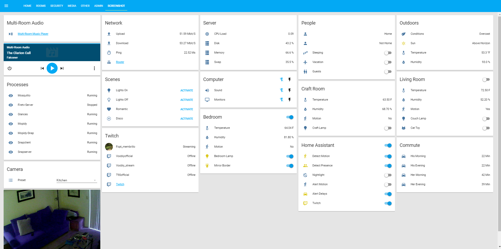

# Home Assistant

## Screenshot



## Configuration Best Pratices

### More than one entity

Always use a YAML list when you have multiple entries (Style #1 from the documentation).

Yes:
```yaml
sensor
- platform: mqtt
  ...
- platform: forecastio
  ...
```

No:
``` yaml
sensor:
  platform: mqtt
  
sensor 2:
  platform: forecastio
```

### When to use `!env_var`

* Private data.
* Constants.

### Namespaces

Use them. Prevents conflicts once you have many sensors, disambiguates generic names, and lends context when referenced. Some components have hardcoded namespacing - don't double up.

### Automations

* Always provide an override switch, use as a condition.
* Inline scripts as actions, unless the script is used in multiple automations.

### Scripts

* Hide scripts that shouldn't be manually triggered.

### Scenes

* Hide scenes that shouldn't be manually triggered.

### Customizations

The interface should be intuitive to encourage use and reduce the learning curve.

* Always set a relevant icon if available (https://materialdesignicons.com/).
* Always set a friendly, descriptive name if the default is insufficient (vague, awkward, computer-generated, etc).

### Includes

Includes help organize configurations. Do not place all configuration in `configuration.yaml`. Split configuration sections to their own files as they grow. Consider splitting up any section that you cannot view without scrolling your editor.
